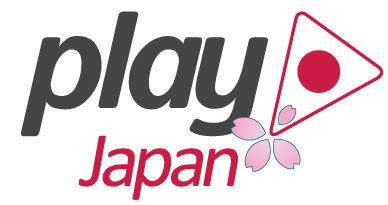

# playframework ドキュメント日本語翻訳プロジェクト

このプロジェクトは [playframework](https://www.playframework.com/) のドキュメントを日本語に翻訳するプロジェクトです。

このプロジェクトの成果は [wwww.playframework.com/documentation/ja](https://www.playframework.com/documentation/ja/) に公開されます。

翻訳にご協力頂ける場合は、[wiki](https://github.com/playframework-ja/translation-project/wiki) をご一読ください。

なにか不明な点がある場合は [@garbagetown](https://twitter.com/garbagetown) までお気軽にお問い合わせください。
